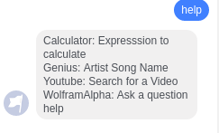

#SpartaHack 2017 Bot

##About

I made this project during SpartaHack 2017 as a fun personal project and fun introduction to the Wolfram API.

##How it was made

I made web requests using Flask, a Python microframework, and used the WolframAlpha Results API to return answers to simple questions.

##Commands

These are the commands my bot can handle.
 
